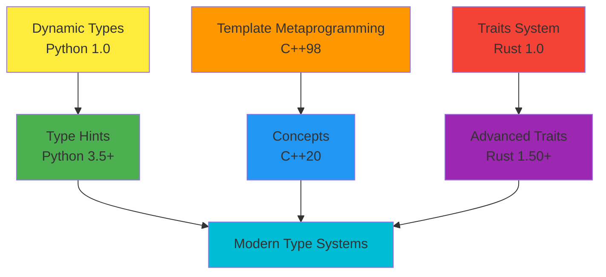
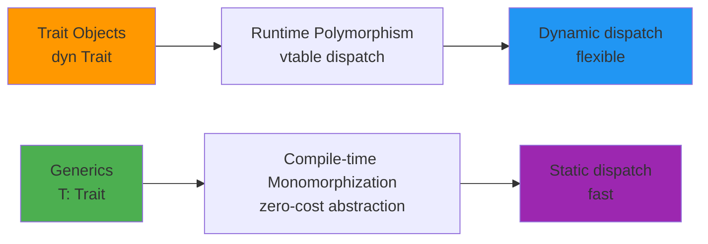
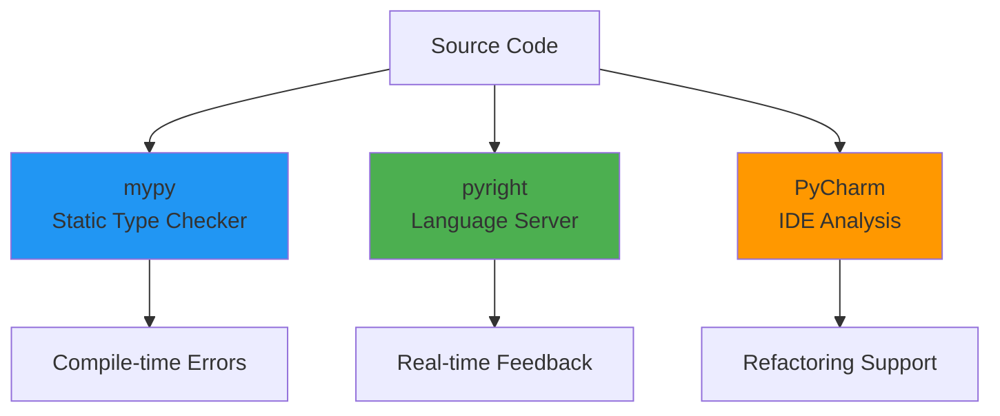
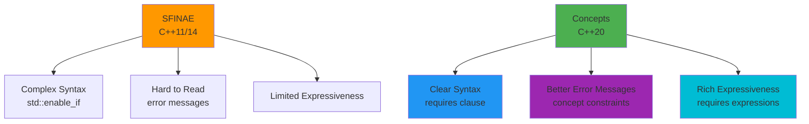
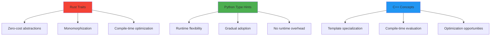
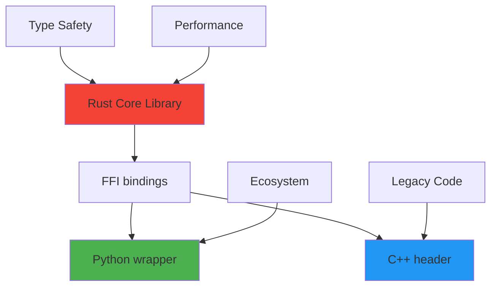
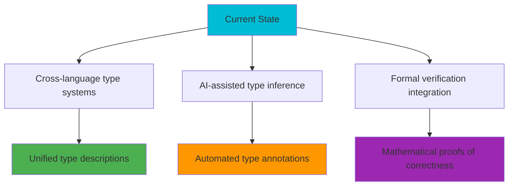

# Type Systems in Modern Programming: Rust Traits, Python Type Hints & C++ Concepts

## 🎯 60-Minute Technical Deep Dive

---

## 📋 Agenda (60 minutes)

| Time | Topic | Description |
|------|-------|-------------|
| 0-5m | 🚀 Introduction | Overview & Motivation |
| 5-15m | 🦀 Rust Traits | Compile-time polymorphism & safety |
| 15-25m | 🐍 Python Type Hints | Runtime checking & gradual typing |
| 25-35m | ⚡ C++ Concepts | Template constraints & SFINAE |
| 35-45m | 🔍 Comparative Analysis | Strengths & trade-offs |
| 45-55m | 💼 Real-world Examples | From projgeom-rs project |
| 55-60m | 🎯 Q&A & Conclusion | Summary & future directions |

---

## 🚀 Introduction (5 minutes)

### The Type Safety Evolution



### Why Type Systems Matter 🤔

- ✅ **Compile-time error detection**
- ✅ **Better IDE support & autocomplete**
- ✅ **Self-documenting code**
- ✅ **Refactoring confidence**
- ✅ **Performance optimizations**

---

## 🦀 Rust Traits (10 minutes)

### What are Traits? 🎭

Traits define shared behavior that types can implement.

```rust
// From our projgeom-rs project
pub trait ProjectivePlane {
    type Point;
    type Line;
    
    fn meet(&self, p1: &Self::Point, p2: &Self::Point) -> Self::Line;
    fn incident(&self, point: &Self::Point, line: &Self::Line) -> bool;
}

impl<T: SignedIntegral> ProjectivePlane for PgPlane<T> {
    type Point = PgPoint<T>;
    type Line = PgLine<T>;
    
    fn meet(&self, p1: &Self::Point, p2: &Self::Point) -> Self::Line {
        PgLine::new(cross_product(p1.coord(), p2.coord()))
    }
    
    fn incident(&self, point: &Self::Point, line: &Self::Line) -> bool {
        dot_product(point.coord(), line.coord()) == T::zero()
    }
}
```

### Trait Objects vs Generics 🔄



### Advanced Trait Features ⚡

```rust
// Associated types
trait Iterator {
    type Item;
    fn next(&mut self) -> Option<Self::Item>;
}

// Higher-ranked trait bounds
fn apply_to_all<F>(items: &mut [i32], f: F) 
where 
    F: Fn(i32) -> i32,
{
    for item in items.iter_mut() {
        *item = f(*item);
    }
}

// Trait bounds with lifetimes
trait Borrow<Borrowed: ?Sized> {
    fn borrow(&self) -> &Borrowed;
}
```

---

## 🐍 Python Type Hints (10 minutes)

### Gradual Typing Philosophy 🌊

Python's type hints are optional but powerful:

```python
# From python_ai version of our project
from typing import TypeVar, Generic, Protocol, runtime_checkable
from dataclasses import dataclass

T = TypeVar('T', bound=int, covariant=True)

@runtime_checkable
class ProjectivePlane(Protocol[T]):
    """Protocol defining projective plane operations"""
    
    def meet(self, p1: 'PgPoint[T]', p2: 'PgPoint[T]') -> 'PgLine[T]': ...
    def incident(self, point: 'PgPoint[T]', line: 'PgLine[T]') -> bool: ...

@dataclass
class PgPoint(Generic[T]):
    """Projective point with homogeneous coordinates"""
    coord: tuple[T, T, T]
    
    def __eq__(self, other: 'PgPoint[T]') -> bool:
        return cross_product(self.coord, other.coord) == (0, 0, 0)
    
    def meet(self, other: 'PgPoint[T]') -> 'PgLine[T]':
        return PgLine(cross_product(self.coord, other.coord))

class PgPlane:
    """Implementation of projective plane"""
    
    def meet(self, p1: PgPoint[T], p2: PgPoint[T]) -> PgLine[T]:
        return p1.meet(p2)
    
    def incident(self, point: PgPoint[T], line: PgLine[T]) -> bool:
        return dot_product(point.coord, line.coord) == 0
```

### Type Checking Tools 🔧



### Advanced Type Features 🎯

```python
# Union types
from typing import Union, Optional

def process_point(point: Optional[PgPoint[int]]) -> Union[PgPoint[int], None]:
    return point

# Literal types
from typing import Literal

Dimension = Literal[2, 3]

def create_point(dim: Dimension, coords: tuple[int, ...]) -> PgPoint[int]:
    if dim == 2:
        return PgPoint((*coords, 1))  # Homogeneous coordinates
    return PgPoint(coords)

# Protocol with runtime checking
@runtime_checkable
class Drawable(Protocol):
    def draw(self) -> None: ...
    
def render(obj: object) -> None:
    if isinstance(obj, Drawable):
        obj.draw()  # Type checker knows this is safe
```

---

## ⚡ C++ Concepts (10 minutes)

### Template Constraints 🎯

C++20 concepts provide elegant template constraints:

```cpp
// From our C++ project
#include <concepts>
#include <type_traits>

template<typename T>
concept SignedIntegral = std::integral<T> && std::signed_integral<T>;

template<typename Point, typename Line>
concept ProjectivePlanePrimitive = requires(const Point& p, const Point& q, const Line& l) {
    { p.meet(q) } -> std::convertible_to<Line>;
    { p.incident(l) } -> std::same_as<bool>;
    { p == q } -> std::same_as<bool>;
};

template<typename Point, typename Line, typename Scalar>
concept ProjectivePlane = ProjectivePlanePrimitive<Point, Line> && requires(
    const Point& p, const Point& q, Scalar lambda, Scalar mu) {
    { p.parametrize(lambda, q, mu) } -> std::convertible_to<Point>;
    { coincident(p, q, p.parametrize(lambda, q, mu)) } -> std::same_as<bool>;
};

template<SignedIntegral Scalar = int64_t>
struct PgPoint {
    using ScalarType = Scalar;
    std::array<Scalar, 3> coord;
    
    constexpr bool incident(const PgLine<Scalar>& line) const noexcept;
    constexpr PgLine<Scalar> meet(const PgPoint& other) const noexcept;
    constexpr PgPoint parametrize(Scalar lambda, const PgPoint& other, Scalar mu) const noexcept;
};
```

### Concept-based Overloading 🔄

```cpp
template<ProjectivePlane<Point, Line, Scalar> Plane>
void check_axiom(const Plane& plane, const Point& p, const Point& q, const Line& l) {
    auto m = plane.meet(p, q);
    assert(m.incident(p));
    assert(m.incident(q));
    assert(m == plane.meet(q, p));  // Commutativity
}

// Specialized implementations
template<SignedIntegral Scalar>
constexpr bool coincident(
    const PgPoint<Scalar>& pt_p,
    const PgPoint<Scalar>& pt_q,
    const PgPoint<Scalar>& pt_r) noexcept {
    const auto cross_ab = cross_product(pt_p.coord, pt_q.coord);
    return dot_product(cross_ab, pt_r.coord) == 0;
}
```

### SFINAE vs Concepts 📊



---

## 🔍 Comparative Analysis (10 minutes)

### Performance Characteristics ⚡



### Trade-offs Matrix 📊

| Feature | Rust | Python | C++ |
|---------|------|---------|-----|
| **Compile-time safety** | ✅ Excellent | ⚠️ Limited | ✅ Excellent |
| **Runtime flexibility** | ⚠️ Limited | ✅ Excellent | ⚠️ Limited |
| **Learning curve** | 🔴 Steep | 🟢 Easy | 🔴 Steep |
| **Tooling** | 🟡 Good | 🟢 Excellent | 🟡 Good |
| **Performance** | ✅ Excellent | ⚠️ Moderate | ✅ Excellent |
| **Expressiveness** | 🟢 Very Good | 🟢 Good | 🟢 Very Good |

### Error Messages Quality 💬

```rust
// Rust: Clear and helpful
error[E0277]: the trait bound `i32: ProjectivePlane` is not satisfied
  --> src/main.rs:15:23
   |
15 |     let plane = PgPlane::<i32>::new();
   |                       ^^^ the trait `ProjectivePlane` is not implemented for `i32`
```

```python
# Python: Runtime errors with type hints
TypeError: Argument 'point' must be of type PgPoint[int], got PgPoint[float]
```

```cpp
// C++20: Much improved concepts errors
error: constraint 'ProjectivePlane<PgPoint<double>, PgLine<double>, double>' is not satisfied
note: because 'PgPoint<double>' does not satisfy 'ProjectivePlanePrimitive'
```

---

## 💼 Real-world Examples (10 minutes)

### Project Geometry Library 📐

Our projgeom project demonstrates all three approaches:

#### Rust Implementation 🦀

```rust
pub trait Geometry {
    type Point;
    type Line;
    
    fn distance(&self, p1: &Self::Point, p2: &Self::Point) -> f64;
    fn angle(&self, p1: &Self::Point, vertex: &Self::Point, p2: &Self::Point) -> f64;
}

impl<T: SignedIntegral + Float> Geometry for EuclideanPlane<T> {
    type Point = EuclideanPoint<T>;
    type Line = EuclideanLine<T>;
    
    fn distance(&self, p1: &Self::Point, p2: &Self::Point) -> f64 {
        ((p2.x - p1.x).powi(2) + (p2.y - p1.y).powi(2)).sqrt()
    }
}
```

#### Python Implementation 🐍

```python
from typing import Protocol, TypeVar, Generic

T = TypeVar('T', int, float)

class Geometry(Protocol[T]):
    """Protocol for geometric operations"""
    
    def distance(self, p1: 'Point[T]', p2: 'Point[T]') -> float: ...
    def angle(self, p1: 'Point[T]', vertex: 'Point[T]', p2: 'Point[T]') -> float: ...

class EuclideanPlane:
    """Euclidean geometry implementation"""
    
    def distance(self, p1: Point[T], p2: Point[T]) -> float:
        return ((p2.x - p1.x)**2 + (p2.y - p1.y)**2)**0.5
```

#### C++ Implementation ⚡

```cpp
template<typename T>
concept Numeric = std::integral<T> || std::floating_point<T>;

template<Numeric T>
class EuclideanPlane {
public:
    using Point = EuclideanPoint<T>;
    using Line = EuclideanLine<T>;
    
    constexpr auto distance(const Point& p1, const Point& p2) const noexcept {
        return std::sqrt(std::pow(p2.x - p1.x, 2) + std::pow(p2.y - p1.y, 2));
    }
    
    constexpr auto angle(const Point& p1, const Point& vertex, const Point& p2) const noexcept {
        // Implementation using arccosine
    }
};
```

### Interoperability Examples 🌐



---

## 🎯 Q&A and Conclusion (5 minutes)

### Key Takeaways 🎯

1. **Rust Traits**: Best for performance-critical applications requiring compile-time guarantees
2. **Python Type Hints**: Ideal for rapid development with gradual type adoption
3. **C++ Concepts**: Powerful for template-heavy libraries requiring fine-grained control

### Future Directions 🔮



### Resources 📚

- **Rust**: [The Rust Book - Traits](https://doc.rust-lang.org/book/ch10-02-traits.html)
- **Python**: [PEP 484 - Type Hints](https://www.python.org/dev/peps/pep-0484/)
- **C++**: [C++20 Concepts - cppreference.com](https://en.cppreference.com/w/cpp/language/constraints)
- **Project**: [projgeom-rs on GitHub](https://github.com/luk036/projgeom-rs)

### Final Thoughts 💭

Choose the right type system for your needs:
- 🚀 **Performance & Safety** → Rust Traits
- 🛠️ **Productivity & Flexibility** → Python Type Hints  
- ⚡ **Control & Compatibility** → C++ Concepts

---

## 🙏 Thank You!

### Questions & Discussion


**Project Repository**: https://github.com/luk036/projgeom-rs

**Contact**: [Your contact information]

---

# 📝 Appendix: Code Examples

## Complete Rust Trait Example

```rust
use std::ops::{Add, Mul};

pub trait VectorSpace {
    type Scalar;
    type Vector;
    
    fn zero() -> Self::Vector;
    fn add(v1: &Self::Vector, v2: &Self::Vector) -> Self::Vector;
    fn scale(s: Self::Scalar, v: &Self::Vector) -> Self::Vector;
}

impl<T: Add<Output = T> + Mul<Output = T> + Copy + Default> VectorSpace for T {
    type Scalar = T;
    type Vector = T;
    
    fn zero() -> Self::Vector { T::default() }
    fn add(v1: &Self::Vector, v2: &Self::Vector) -> Self::Vector { *v1 + *v2 }
    fn scale(s: Self::Scalar, v: &Self::Vector) -> Self::Vector { s * *v }
}
```

## Complete Python Protocol Example

```python
from typing import Protocol, TypeVar, Generic, runtime_checkable

T = TypeVar('T', bound='SupportsArithmetic')

@runtime_checkable
class SupportsArithmetic(Protocol[T]):
    def __add__(self, other: T) -> T: ...
    def __mul__(self, scalar: T) -> T: ...

class VectorSpace(Generic[T]):
    def __init__(self, zero_factory: callable):
        self.zero = zero_factory()
    
    def add(self, v1: T, v2: T) -> T:
        return v1 + v2
    
    def scale(self, scalar: T, vector: T) -> T:
        return scalar * vector
```

## Complete C++ Concept Example

```cpp
#include <concepts>
#include <type_traits>

template<typename T>
concept Addable = requires(T a, T b) {
    { a + b } -> std::same_as<T>;
};

template<typename T>
concept Scalable = requires(T a, T b) {
    { a * b } -> std::same_as<T>;
    { std::is_default_constructible_v<T> };
};

template<typename T>
concept VectorSpace = Addable<T> && Scalable<T> && std::is_default_constructible_v<T>;

template<VectorSpace T>
class VectorSpaceOperations {
public:
    static constexpr T zero() { return T{}; }
    static constexpr T add(const T& a, const T& b) { return a + b; }
    static constexpr T scale(const T& scalar, const T& vector) { return scalar * vector; };
};
```